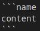

<div dir="rtl">

# آموزش زبان Markdown (فارسی)

اینجا زبان **markdown** را یادبگیرید.

- ## هدینگ یا سربرگ

What are **Heading**s? The title or the name of a document or even an chapter of a book is a **Heading**. Now, let's learn how to use them!

In **HTML** we use `<h1></h1>` tag. These are **Heading**s. But not **md**. We use `#` instead of `<h1></h1>` tags. Fitst I will show you **HTML** way and next, **Markdown**!

HTML:

<div dir="ltr">

```html
<h1>Heading</h1>
<h2>Heading</h2>
<h3>Heading</h3>
<h4>Heading</h4>
<h5>Heading</h5>
<h6>Heading</h6>
```

</div>

خروجی:

# Heading
## Heading
### Heading
#### Heading
##### Heading
###### Heading

Ok, But how to use these in **Markdown**?

Markdown:

<div dir="ltr">

```markdown
# Heading
## Heading
### Heading
#### Heading
##### Heading
###### Heading
```

</div>

خروجی:

# Heading
## Heading
### Heading
#### Heading
##### Heading
###### Heading

As you can see, we use `#`. If your heading is `<h2>`, use `##`. Hope you got the point!

---

- ## استایل متن

معنیه استایل متن همان ایتالیک کردن یا بولد کردن متن میباشد.

ما داخل **HTML** تگ های مخصوص را داریم که در اینجا دیگر نیازی به آنها نیست. برای مثال بولد کردن. فقط از `**` استفاده میشود.

HTML:

<div dir="ltr">

```html
من <b>امیر</b> هستم. از آشنایی با <b>شما</b> خوشبختم.
```

</div>

خروجی:

من **امیر** هستم. از آشنایی با **شما** خوشبختم.


داخل **MD** تغییر زیادی ندارد.

Markdown:

<div dir="rtl">

```markdown
من **امیر** هستم. از آشنایی با **شما** خوشبختم.
```

</div>

خروجی:

من **امیر** هستم. از آشنایی با **شما** خوشبختم.

اما ولی چطوری حالا متن رو ایتالیک کنیم؟ فقط کافیه از یه ستاره استفاده کنیم! `*`.

HTML:

<div dir="ltr">

```html
اون گفت <i>من عاشق استفاده از گیت هستم</i>.
```

</div>

خروجی:

اون گفت *من عاشق استفاده از گیت هستم*.

داخل **MD** هم خروجی فرقی نمیکنه.

Markdown:

<div dir="rtl">

```markdown
اون گفت *من عاشق استفاده از گیت هستم*.
```

</div>

خروجی:

اون گفت *من عاشق استفاده از گیت هستم*.

---

- ## لینک ها

شاید لازم باشه داخل متن از لینک استفاده کنید. از **HTML** کمک میگیرید؟ این کار رو همین الان بزارید کنار!

ما الان به سینتکس لینک دهی توی **Markdown** آشنا میشویم.

HTML:

<div dir="ltr">

```html
ورود به <a href="https://google.com">گوگل</a>
```

</div>

خروجی:

ورود به [گوگل](https://google.com)

Markdown:

<div dir="ltr">

```markdown
[گوگل](https://google.com) ورود به
```

</div>

ورود به [گوگل](https://google.com)

راحت یه لینک درست کردیم. داخل `[]`, اسم رو بزارید و داخل `()` لینک رو بزارید.

---

- ## عکس ها

I love puting images in **Markdown**. Simple, Fast and easy syntax. As always, how is **HTML** way?

HTML:

<div dir="ltr">

```html

```

</div>

خروجی:

[](https://wallpapercave.com/wp/wp3385761.jpg)

In **MD** this is more easiler. Just pay attention.

Markdown:

<div dir="ltr">

```markdown
[](link of picture)
```

</div>

Ok, In first sight, what did you remember? Linking. Right. kind of same. But in Link text we use ``. Image url is the image `src` and image alt is a text that if pictue couldn't load, text will be appear. And `link of picture` is a link that will be for picture. I mean when people click on it, will go to that link.

That was how we use images!

---

- ## لیست ها

ما دو نوع لیست داریم. ترتیبی و غیر ترتیبی. داخل **HTML** این دو نوع وجود دارد. اما ولی داخل **Markdown** فقط غیر ترتیبی وجو دارد.

HTML:

<div dir="ltr">

```html
<ul>
    <li>آیتم 1</li>
    <li>آیتم 2</li>
    <li>آیتم 3</li>
</ul>
```

</div>

خروجی:

- آیتم 1
- آیتم 2
- آیتم 3

و فقط داخل **markdown** از `-` استفاده میکنیم.

Markdown:

<div dir="ltr">

```markdown
- آیتم 1
- آیتم 2
- آیتم 3
```

</div>

چقدر ساده بود؟ خیلی زیاد!

---

- ## هایلایت ها

وقتشه که بخشی رو توضیح بدیم که خیلی خوشم میاد ازش. اون هم **هایلایت** ها میباشد. هایلایت های بلاکی و حتی هایلایت های خطی.

ابتدا در باره هایلایت **خطی** صحبت میکنیم. همچین چیزی داخل **HTML** وجود ندارد. پس مستقیم میریم سراغ کد **Markdown**.

<div dir="rtl">

```markdown
این یک `متن هایلایت شده` مباشد.
```

</div>

خروجی:

این یک `متن هایلایت شده` مباشد.

خب ما هایلایت خطی را یادگرفتیم. پس چطوری همچین چیزی رو میتونیم بسازیم؟ :

<div dir="ltr">

```python
from platform import system as pltfrm
from os import system as sstm

if pltfrm().lower() == "windows":
    sstm("cls")
elif pltfrm().lower() == "linux":
    sstm("clear")
else:
    sstm("clear")
```

</div>

خیلی ساده. به نمونه کد زیر دقت کنید.

<div dir="ltr">

[](https://github.com/BlackIQ/markdown)

</div>

خب، `name` چیست؟‌نام همان اسم زبان میباشد که ما کد آن را مینویسیم. آن بلاک، یک بلاک پایتون بود. پس از پایتون رو به روی ` ``` ` استفاده شد.

اتمام هایلایت ها!

---

- ## تودو ها

از تودو ها در **markdown** استفاده کنید.

- [x] رفتن به مدرسه
- [ ] خرید لامپ
- [x] شستن دست ها

<div dir="ltr">

```markdown
- [x] رفتن به مدرسه
- [ ] خرید لامپ
- [x] شستن دست ها
```

</div>

استفاده از تودو ها واقعا جالبه.

---

- ## نقل قول

فکر کنید میخواهید همچین نقل قولی را قرار دهید:

<div dir="ltr">

> I'm gonna make him an offer he can't refuse.

</div>

ساختار به این صورت میباشد.

<div dir="ltr">

```markdown
> I'm gonna make him an offer he can't refuse
```

</div>

</div>